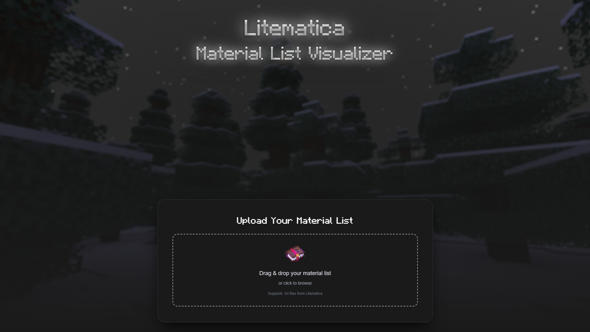

    

<h1 align="center">
    Litematica Material List Visualizer
</h1>

    LMLV is a simple web app that turns your Litematica material list text files into a clean, organized layout for planning your builds. Instead of taking tons of screenshots or constantly pausing your game, you can see everything you need in one easy-to-read place.     Check it out at <a href="placeholder" target="_blank">placeholder.com</a>.

## Preview

    

## Steps

1. **Upload**: Drop your .txt material list into the box or click to browse for it
2. **Processing**: The app automatically reads and organizes all your materials
3. **View**: Instantly see your full material list in a clean, easy-to-read layout

